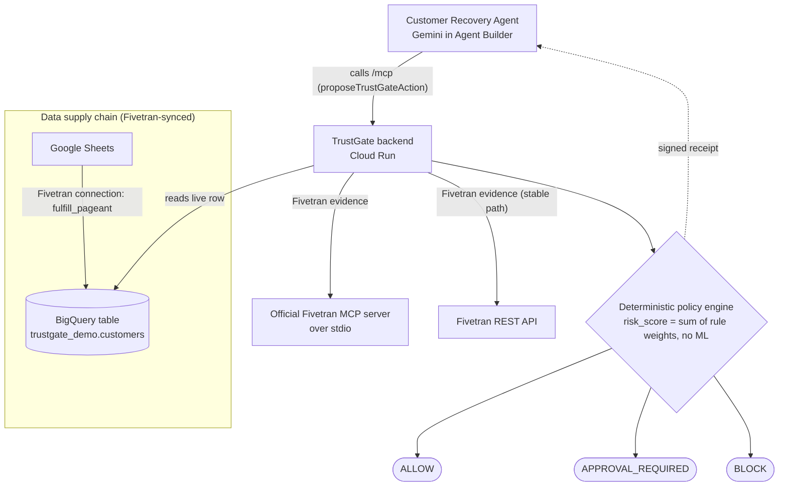

# TrustGate for AI Agents

TrustGate is a runtime gate I built between a Gemini agent and a refund action. The agent proposes the action; TrustGate checks live Fivetran evidence, a local input contract, and a deterministic policy before returning `ALLOW`, `APPROVAL_REQUIRED`, or `BLOCK`.

This repo is intentionally scoped as a hackathon proof, not a production platform claim. The part I care about proving is the loop:

I am keeping the build log, demo script, and setup notes public so judges and other builders can reproduce the flow instead of only watching the video.

```text
Gemini / Vertex AI function call
-> proposeTrustGateAction
-> Cloud Run TrustGate API
-> live Fivetran REST evidence
-> live BigQuery row evidence from the Fivetran-synced table
-> deterministic policy decision
-> receipt returned to the agent
```

## Architecture



The Gemini agent only calls TrustGate's own `/mcp` surface. TrustGate's backend is what calls the official Fivetran MCP server, Fivetran REST, and the Fivetran-synced BigQuery row, then a deterministic policy returns the decision.

## Current Proof

- Hosted app/API: `https://trustgate-24801890031.us-central1.run.app`
- Gemini agent endpoint: `POST /api/agent/run`
- Action endpoint: `POST /api/actions/propose`
- MCP tool endpoint for Agent Builder `Add tools -> MCP Server`: `POST /mcp` (TrustGate's own MCP surface, not Fivetran's MCP)
- OpenAPI spec for tool imports when available: `/openapi.json`
- Live Fivetran REST evidence observed in receipts: `source=fivetran_rest_live`
- Live Fivetran MCP evidence (official Fivetran MCP server at runtime): `source=fivetran_mcp_live` via `/api/fivetran/mcp-evidence`
- Live BigQuery evidence observed in hosted receipts: `source=bigquery_rest_live`
- Fivetran connection used in the demo: `fulfill_pageant`
- Working Gemini paths: hosted `/api/agent/run` and `scripts/vertex_trustgate_agent_demo.py`
- Build notes with the things that broke: `BUILD_LOG.md`
- Exact video flow: `DEMO_SCRIPT.md`

## What It Does

The demo is a customer recovery agent deciding whether a refund may proceed.

1. Safe data and a normal refund amount return `ALLOW`.
2. A new observed `customer_tier` value outside contract v1 returns `APPROVAL_REQUIRED`.
3. A scoped human approval can allow refunds under `$50` until contract v2 is reviewed.
4. A critical schema/connection failure returns `BLOCK`.

Gemini explains the receipt. Gemini does not decide the policy.

`risk_score` is not a model confidence score. It is a transparent sum of triggered rule weights, shown as `risk_breakdown` in the receipt.

## Dashboard

Opening the hosted URL (or `localhost:8080`) loads an interactive control-room dashboard, not just an API. From the Action Console you set a refund amount and run the agent or the policy. Each decision renders as:

- a colour-coded decision banner (green `ALLOW`, amber `APPROVAL_REQUIRED`, red `BLOCK`) with the one-line reason and the receipt id,
- an evidence trace, Agent -> Fivetran -> BigQuery -> Policy, with the live source at each step,
- evidence cards for the Fivetran REST data, the BigQuery row, the contract diff, and the risk breakdown,
- a `Gemini Agent Run` panel with the tool call and Gemini's explanation,
- a developer-view toggle for the raw receipt JSON.

The `Simulate` buttons inject a new customer tier, a stale sync, or a schema failure so the three decision paths can be shown live. The web app is served by the Cloud Run service. It is built with React loaded as a local vendored bundle (no build step), so the same `public/` is served identically in local dev and on Cloud Run.

## Run Locally

```bash
npm run check
npm test
npm start
```

Open `http://localhost:8080`.

Without Fivetran credentials, the app uses clearly labeled demo evidence. With credentials, it reads Fivetran REST evidence.

Small reliability endpoints:

```bash
curl http://localhost:8080/health
curl http://localhost:8080/api/healthz
curl http://localhost:8080/readyz
```

`/health` and `/api/healthz` are simple liveness checks. `/readyz` reports configuration status by env var name only. It does not return secret values or call external APIs.

## Fivetran Evidence

For the Fivetran track, TrustGate now uses both integration paths listed in the hackathon Fivetran resources: the Fivetran REST API and the official open-source Fivetran MCP server. REST is the stable evidence path, and the MCP server is an additional live partner-evidence path shown in `evidence.fivetran_mcp`.

Create `.env` from `.env.example` and add a scoped Fivetran API key:

```bash
FIVETRAN_API_KEY=...
FIVETRAN_API_SECRET=...
FIVETRAN_CONNECTION_ID=fulfill_pageant
```

TrustGate reads Fivetran:

- `GET /v1/connections/{connectionId}`
- `GET /v1/connections/{connectionId}/schemas`
- `GET /v1/connections/{connectionId}/state` only when the connector supports it

For my Google Sheets connection, `/state` returned `405`, so the server treats that call as optional and keeps the receipt honest.

Test the evidence endpoint:

```bash
curl http://localhost:8080/api/fivetran/evidence
```

The important proof is the real Fivetran field inside the action receipt.

## Fivetran MCP

TrustGate also calls the official Fivetran MCP server (`github.com/fivetran/fivetran-mcp`) at runtime. The Cloud Run container installs that server, and the TrustGate backend spawns it over stdio and calls `list_connections` and `get_connection_details` to gather Fivetran evidence. Each action receipt includes an `evidence.fivetran_mcp` block, and there is a dedicated endpoint:

```bash
curl https://trustgate-24801890031.us-central1.run.app/api/fivetran/mcp-evidence
```

A healthy response shows `source: fivetran_mcp_live`, `details_verified: true`, and `target_connection_present: true` for `fulfill_pageant`.

To be precise about the architecture:

- The Gemini agent (Agent Builder) calls TrustGate's own agent-facing MCP endpoint, `/mcp` (`proposeTrustGateAction`).
- TrustGate's backend then calls the official Fivetran MCP server over stdio for Fivetran evidence.
- Fivetran REST remains the stable evidence path, so a decision still works if the MCP process is unavailable.

So TrustGate uses Fivetran REST and the official Fivetran MCP server at runtime. The MCP integration can be turned off with `FIVETRAN_MCP_DISABLED=1`, in which case TrustGate falls back to REST only.

## BigQuery Evidence

The hosted service queries the Fivetran-synced BigQuery table:

```text
trustgate-hackathon.trustgate_demo.customers
```

The receipt includes `evidence.bigquery.source`. Strong demo proof is:

```text
bigquery_rest_live
```

If the hosted endpoint says `bigquery_rest_live_partial`, BigQuery is readable but the Fivetran table column names do not include a recognizable `customer_tier`. The response includes `available_columns` so I can fix the sheet/schema instead of guessing.

Data freshness is a real signal, not a mock. TrustGate reads the Fivetran-managed `_fivetran_synced` column on the selected BigQuery row and reports `real_freshness_minutes` (minutes since the last sync) against the contract `freshness_sla_minutes`. When the age exceeds the SLA, the policy adds the `stale_sync_supporting_signal` rule. The demo `Simulate stale sync` button sets `freshness_simulated: true` and a stale age so the SLA breach can be shown on camera; the receipt always reports the real sync age alongside the simulated flag, so the simulation is never hidden.

The SLA is configurable with `FRESHNESS_SLA_MINUTES` (default 1440 = 24h) so it can match the connector's real sync cadence. For a clean baseline `ALLOW` during recording and the judging window, set the Fivetran connector to a scheduled sync that runs within the SLA (so the synced data stays recent); otherwise raise `FRESHNESS_SLA_MINUTES` to cover the gap. The `Simulate stale sync` injection always exceeds the SLA regardless of its value.

For local development without Google credentials, TrustGate falls back to clearly labeled `demo_bigquery_contract_query`.

## Gemini Tool Path

I first looked for an OpenAPI import in the Agent Builder / Agent Studio UI I had access to. That UI showed Google Search, URL Context, and MCP Server, but I did not see an OpenAPI import path.

Because the UI exposes an `Add tools -> MCP Server` path, TrustGate now serves its own MCP-compatible tool endpoint so the agent can be built directly in Vertex AI Agent Designer:

```text
POST /mcp
```

This endpoint speaks the MCP streamable-HTTP JSON-RPC protocol and exposes one tool, `proposeTrustGateAction`. In Agent Designer I add it with `Add tools -> MCP Server` and the endpoint URL, and the agent discovers the tool automatically.

To be precise about what this is: `/mcp` is TrustGate's own MCP tool surface for agents. It is not Fivetran's MCP server. Separately, the TrustGate backend spawns the official Fivetran MCP server over stdio and adds that result to receipts as `evidence.fivetran_mcp`.

The hosted app also has a visible Gemini run endpoint:

```text
POST /api/agent/run
```

That endpoint calls Vertex AI Gemini, gives Gemini the `proposeTrustGateAction` function declaration, executes the requested TrustGate action on Cloud Run, and sends the receipt back to Gemini for the final explanation. The dashboard has a `Gemini Agent Run` panel so the video can show the actual function call, the TrustGate receipt, and Gemini's final answer in one place.

I also kept the original Cloud Shell script because it is useful as a separate terminal proof:

```bash
python scripts/vertex_trustgate_agent_demo.py
```

That script defines `proposeTrustGateAction`, lets `gemini-3.5-flash` request the tool call, POSTs the arguments to Cloud Run, and passes the TrustGate receipt back with `Part.from_function_response`.

Docs:

- `docs/vertex-agent-function-calling.md`
- `docs/cloud-run-agent-builder.md`
- `docs/openapi-tool.yaml`

## Deploy

```bash
scripts/deploy-cloud-run.sh
```

```powershell
.\scripts\deploy-cloud-run.ps1
```

The deploy scripts grant the Cloud Run service account BigQuery read/query roles and `roles/aiplatform.user` so the hosted `/api/agent/run` route can call Gemini from Cloud Run metadata auth.

If Cloud Run authentication is enabled later, the calling agent service account needs `roles/run.invoker`.

## Production Hardening Path

I am not calling this production-ready. The current build proves the runtime decision loop for the hackathon. The next engineering work I would do before trusting this in a real workflow:

- Protect mutating endpoints like `/api/actions/propose`, `/api/demo/*`, and `/api/approvals/*` with IAM, IAP, or signed internal calls.
- Move the policy and input contract into versioned config files instead of keeping all demo policy rules in `server.js`.
- Persist decision receipts and approval receipts in immutable storage so a later review can replay the same input, evidence, policy version, and result.
- Add Cloud Logging metrics for `ALLOW`, `APPROVAL_REQUIRED`, `BLOCK`, evidence failures, and Gemini tool-call failures.
- Add CI with syntax checks, policy tests, and secret scanning before every push.
- Replace the public demo reset/inject routes with a separate demo mode flag.

## Product Path

The hackathon version proves one refund authorization loop. The product version would become an action gateway for agents:

1. Authenticated agent identity on every proposed action.
2. Immutable audit receipts with replayable evidence, policy version, and contract version.
3. Versioned input contracts with policy tests before a contract can go live.
4. Enterprise approval workflow with approver identity, expiry, and scoped exceptions.
5. Multi-action support for refunds, discounts, account changes, invoice adjustments, and access changes.

That is the gap between this prototype and a product I would trust in a real business workflow.

## Claims I Am Not Making

- I am not claiming this is production-ready.
- I am not claiming TrustGate detects invisible meaning changes when schema and values are unchanged.
- I am not claiming the Gemini agent calls Fivetran's MCP directly. The agent calls TrustGate's `/mcp` tool; TrustGate's backend is the one that calls the official Fivetran MCP server (alongside Fivetran REST), shown as `fivetran_mcp_live` in the receipt.
- I am not claiming `risk_score` is ML.
- I am not claiming the Agent Builder UI OpenAPI path worked for me unless I record that exact path.